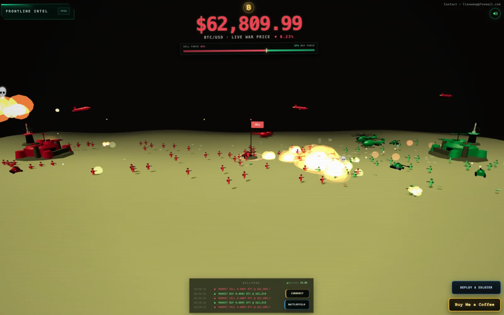
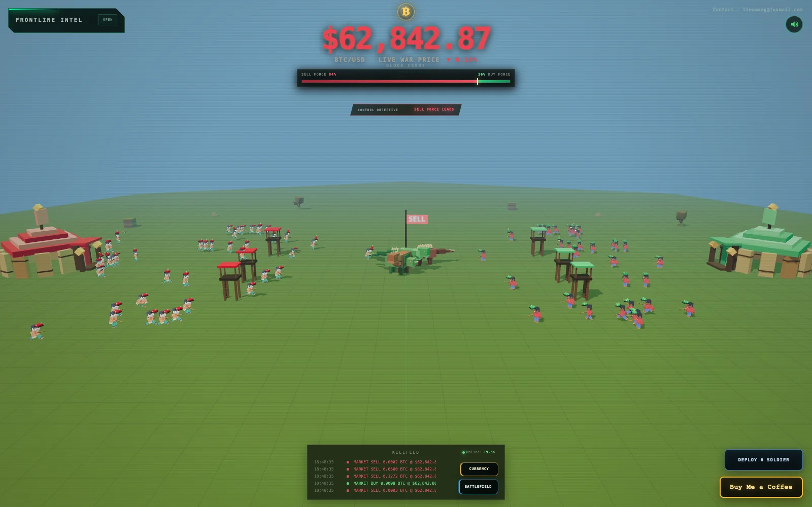
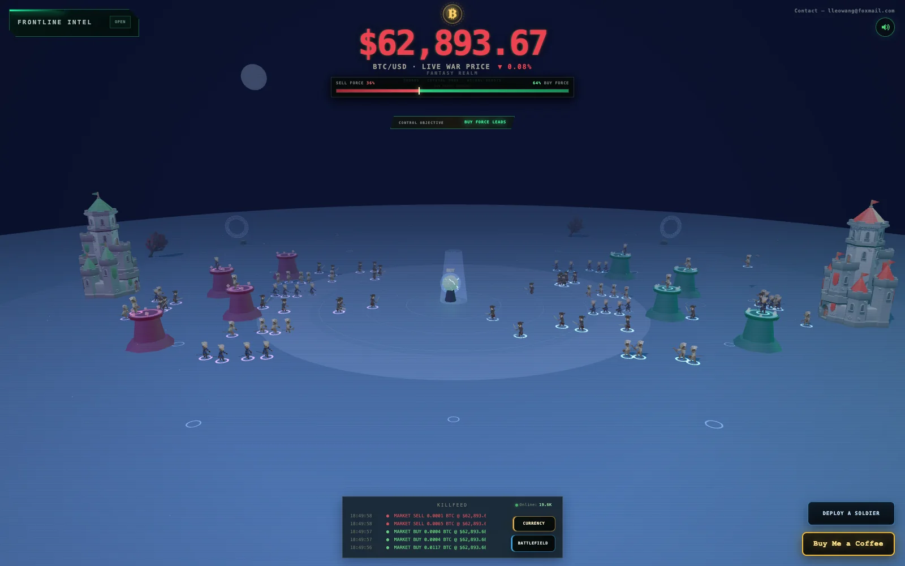
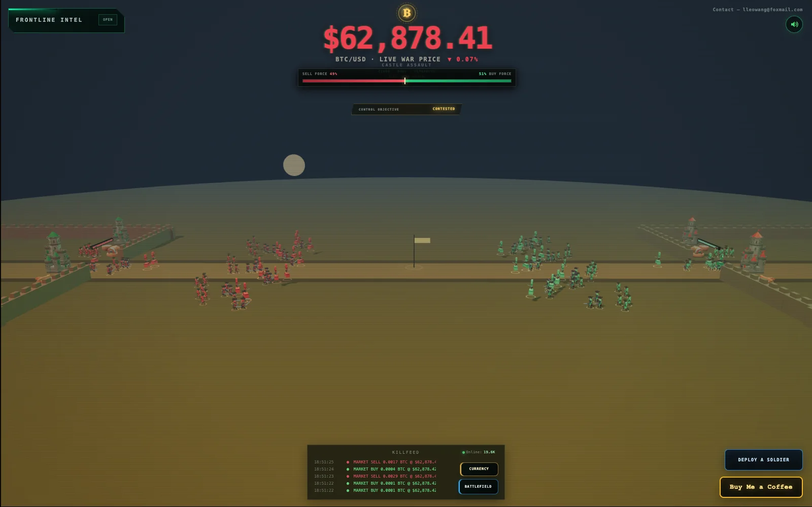
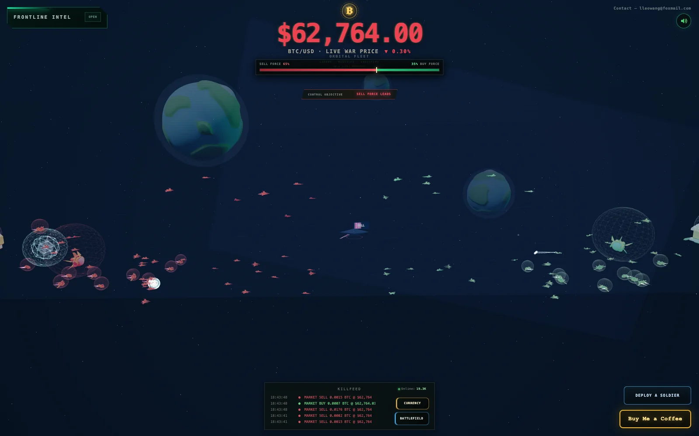
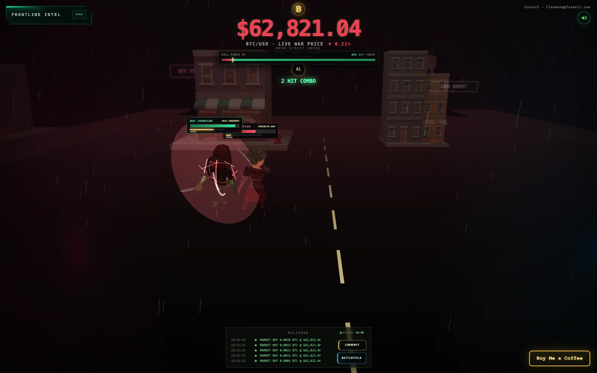

# BTC War

**Live BTC price and Bitcoin order flow visualized as a real-time 3D battlefield.**

[Launch BTC War](https://btcwar.net/) · [View live BTC price](https://btcwar.net/btc-price)

BTC War turns live Binance Spot BTC/USDT market data into an interactive visualization. Bitcoin buyers and sellers become opposing forces, while BTC order flow, order-book depth, executed trades, and buy/sell pressure shape the battle in real time.

## Explore Bitcoin market data

- Live BTC price with 24-hour high, low, change, and volume
- BTC/USDT order flow and executed trades
- Bitcoin order-book depth and market liquidity
- Real-time BTC buy pressure and sell pressure
- Browser-based Three.js and WebGL visualization

BTC War is free to use and requires no account. Market data is informational and is not financial advice.

**Website:** https://btcwar.net/  
**BTC price page:** https://btcwar.net/btc-price

## Six live battlefields

| BTC War | Voxel Siege |
| --- | --- |
|  |  |
| Arcane War | Medieval Siege |
|  |  |
| Space War | Champion Duel |
|  |  |

Each scene reads the same live market pressure through a different combat language. The currency selector supports BTC, ETH, BNB, SOL, XRP, TRON, DOGE, ZEC, and ADA against USDT.

[See how live order flow drives all six battlefields](https://vibewhip.github.io/btc-war/crypto-order-flow-six-3d-battlefields/).

## BTC market guides

- [How BTC War turns live BTC price and order flow into a 3D battlefield](https://github.com/VibeWhip/btc-war/discussions/1)
- [Why live BTC prices differ across exchanges — and what market depth adds](https://github.com/VibeWhip/btc-war/discussions/2)
- [BTC order flow vs order book: what live buy and sell pressure actually means](https://github.com/VibeWhip/btc-war/discussions/3)
- [Bitcoin price vs market depth: what a live BTC quote cannot show](https://github.com/VibeWhip/btc-war/discussions/4)
- [BTC price today: what 24-hour change, volume, and market depth mean](https://vibewhip.github.io/btc-war/btc-price-today-volume-market-depth/)
- [Bitcoin price, market depth, and order flow: a practical glossary](https://vibewhip.github.io/btc-war/bitcoin-price-market-depth-order-flow/)
- [How live crypto order flow drives six 3D battlefields](https://vibewhip.github.io/btc-war/crypto-order-flow-six-3d-battlefields/)
- [Turning live Bitcoin order flow into a 3D battlefield](https://dev.to/vibewhip/turning-live-bitcoin-order-flow-into-a-3d-battlefield-b5f)
- [BTC price, order book, and order flow are three different things](https://medium.com/p/7cd5ba5e58b2)

This public repository contains project documentation only. Private application source code, deployment configuration, credentials, and build artifacts are not published here.
